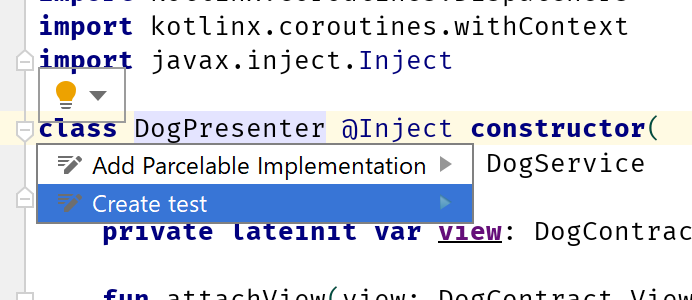
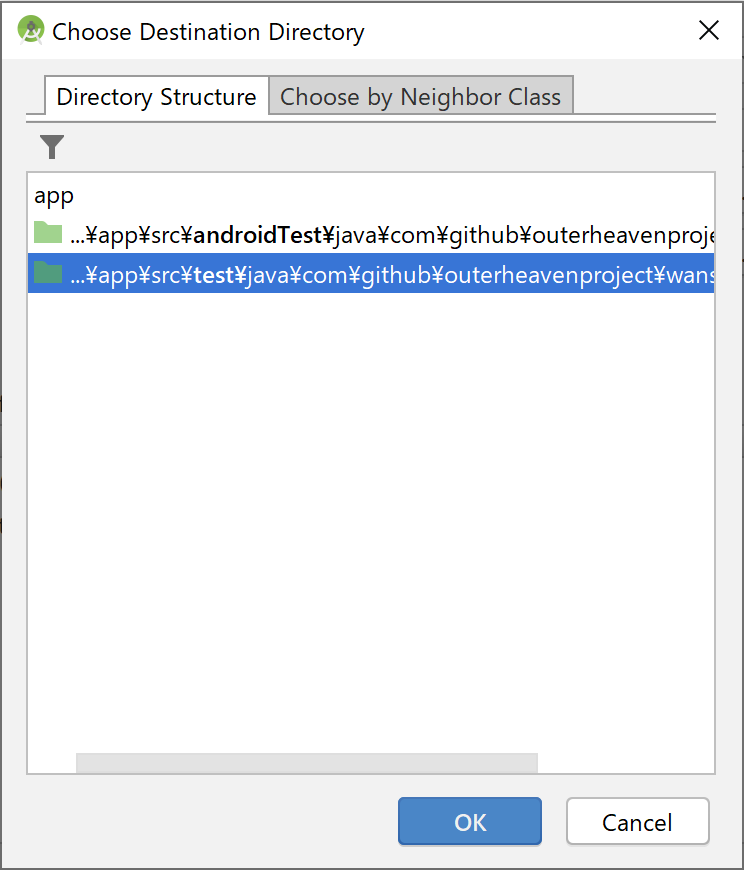

## Daggerで依存性を解決しているクラスのテスト

<!--
start: intro-dagger
goal:  intro-dagger-testing
-->

> あなたは無事にDaggerを導入することが出来ました！
> 次に取り組むはDagger化されたクラスに対してテストを書くことです。

### テストに使うフレームワーク類の導入

```./app/build.gradle
dependencies {
    // ...
    testImplementation 'androidx.test:core-ktx:1.2.0'
    testImplementation 'androidx.test.ext:junit-ktx:1.1.1'
    testImplementation 'org.jetbrains.kotlinx:kotlinx-coroutines-test:1.2.2'
    testImplementation "org.robolectric:robolectric:4.3"
    testImplementation "com.google.truth:truth:0.45"
    // ...
}
```

### テストコードを記述するファイルの作成

前回、Daggerにて依存解決を行ったクラスは `DogPresenter` と `ShibaPresenter` でした。
今回も `DogPresenter` のテスト記述についてのみ説明します。






### テストを書く

`DogPresenter`の`start()`メソッドを実行すると、`attachView(view)`で設定した `DogContract.View` に対して取得したデータがセットされます。
つまり、`start()`メソッドを実行したときにviewの値が変化するかどうかをテストすると良いことになります。

ひとまず、テストフレームワークを使うためのアノテーションを記述します。

```DogPresenterTest.kt
@RunWith(AndroidJUnit4::class) // 👈
class DogPresenterTest {
    // ...
}
```

次に、`DogPresenterTest` クラス外に以下のモッククラスを記述します。

```DogPresenterTest.kt
@RunWith(AndroidJUnit4::class)
class DogPresenterTest {
    // ...
}

// 👇
private class TestDogService : DogService {
    override suspend fun getDog(): Dog {
        return Dog(url = "1", status = "success")
    }

    override suspend fun getDogs(limit: Int): Dogs {
        return Dogs(urls = listOf("1"), status = "success")
    }

    override suspend fun getBleed(bleed: String, limit: Int): Dogs {
        return Dogs(urls = listOf("1"), status = "success")
    }
}

private class TestView : DogContract.View {
    var called: Int = 0

    override fun updateDogs(dogs: Dogs) {
        called += 1
    }
}
```

```DogPresenterTest.kt
@RunWith(AndroidJUnit4::class)
class DogPresenterTest {
    private lateinit var presenter: DogPresenter
    private lateinit var dogService: DogService
    private lateinit var view: TestView

    @Before
    fun setUp() {
        dogService = TestDogService()
        view = TestView()
        presenter = DogPresenter(dogService = dogService)
        presenter.attachView(view)
    }

    @Test
    fun start() {
        runBlockingTest {
            presenter.start()
        }

        assertThat(view.called).isEqualTo(1)
    }
}

// ...
```

### テストを実行する

手っ取り早い方法としては、`DogPresenterTest.kt`を開き、コード行数が書かれている箇所にある再生マークのような部分をクリックし、`Run DogPresenterTest`をクリックすることでテストを実行することが出来ます。

無事にテストをPassできるでしょうか・・・？

### 宿題

- テストが一発でPassするのは少し気持ち悪いです（本当にテストが回ってなくても似たような挙動になります）。 `isEqualTo(1)` を `isNotEqualTo(1)` とか `isEqualTo(0)` に変えてテストを実行してみて、テストが落ちることを確認しましょう。
- 例によって `ShibaPresenter` のテストはまだ書かれていません。書いてみましょう。

