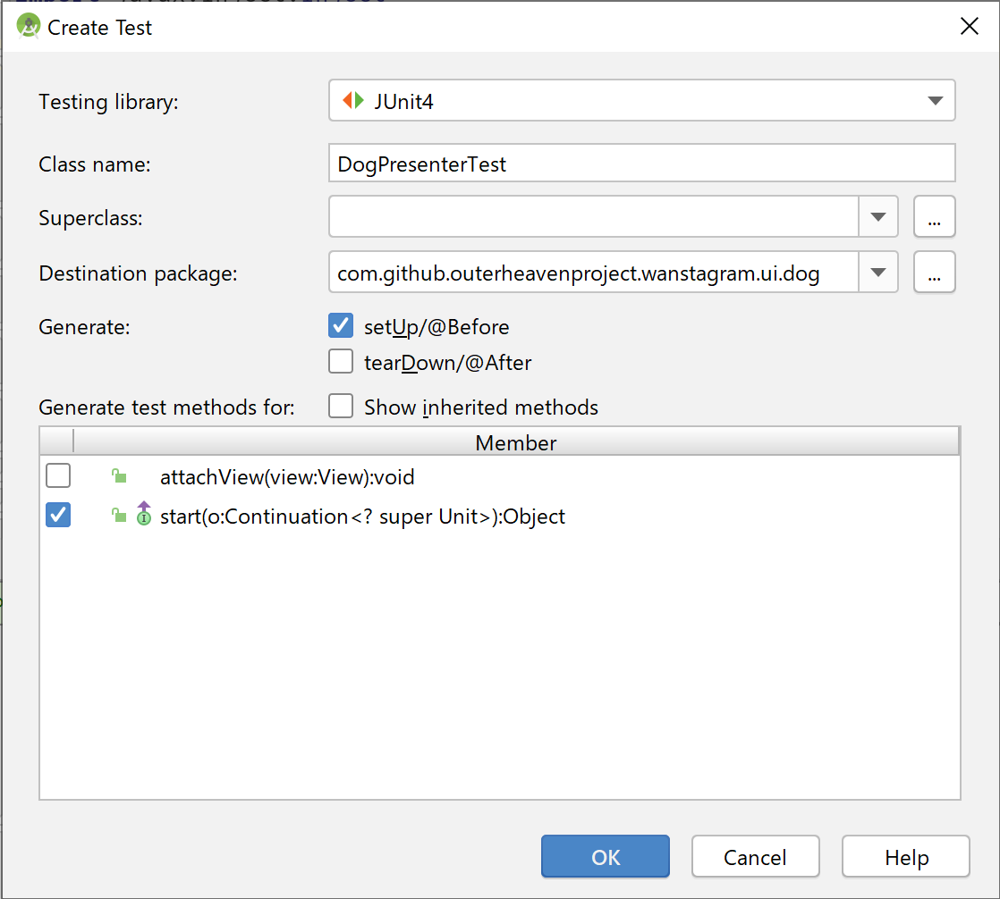

## Daggerで依存性を解決しているクラスのテスト

<!--
start: intro-dagger
goal:  intro-dagger-testing
-->

Positive
: あなたは無事にDaggerを導入することが出来ました！次に取り組むはDagger化されたクラスに対してテストを書くことです。

### テストに使うフレームワーク類の導入

テスト用フレームワーク類を導入します。
Assertionライブラリとして[Truth](https://truth.dev/)を使用します。
Android APIを使用するテストは `androidTest` 内にテストコードを用意して実施しますが、開発マシン上でテストを動作させるほうが高速です。
開発マシン上でAndroid APIをシミュレートするために、[Robolectric](http://robolectric.org/)を導入します。
一部の実装でcoroutineを使用しています。テストコード上では非同期で実行されるコードを待ち合わせる必要がありますが、
それを実現するために `kotlinx-coroutines-test` を導入します。
Kotlinでの書きやすさを実現するためにいくつか `ktx` を導入します。

```./app/build.gradle
dependencies {
    // ...
    testImplementation 'androidx.test:core-ktx:1.2.0'
    testImplementation 'androidx.test.ext:junit-ktx:1.1.1'
    testImplementation 'org.jetbrains.kotlinx:kotlinx-coroutines-test:1.2.2'
    testImplementation "org.robolectric:robolectric:4.3"
    testImplementation "com.google.truth:truth:0.45"
    // ...
}
```

### テストコードを記述するファイルの作成

前回、Daggerにて依存解決を行ったクラスは `DogPresenter` と `ShibaPresenter` でした。
今回、 `DogPresenter` のテスト記述について説明します。

Android Studioにおけるテストコードの生成方法について解説します。
まず、テストを作成したいクラスにカーソルのフォーカスを合わせると、💡(電球)アイコンが表示されます。
これをクリックし、`Create test` を選択します。


`Create test`のダイアログでは、初期生成するコードについていくつか確認があります。
今回は画像の通り、 `setUp/@Before` をONにし、 `start` メソッドのみチェックを付けて `OK` を押します。



`Choose Destination Directory` では `test` ディレクトリを選択します。


`OK` を押すと `DogPresenterTest` が生成され、IDE上で開かれます。

### テストを書く

`DogPresenter`の`start()`メソッドを実行すると、`attachView(view)`で設定した `DogContract.View` に対して取得したデータがセットされます。
つまり、`start()`メソッドを実行したときにviewの値が変化するかどうかをテストすれば良いことになります。

ひとまず、テストフレームワークを使うためのアノテーションを記述します。

```DogPresenterTest.kt
@RunWith(AndroidJUnit4::class) // 👈
class DogPresenterTest {
    // ...
}
```

次に、（`DogPresenterTest.kt`の中の）`DogPresenterTest` クラスの外に以下のモッククラスを記述します。

```DogPresenterTest.kt
@RunWith(AndroidJUnit4::class)
class DogPresenterTest {
    // ...
}

// 👇
private class TestDogService : DogService {
    override suspend fun getDog(): Dog {
        return Dog(url = "1", status = "success")
    }

    override suspend fun getDogs(limit: Int): Dogs {
        return Dogs(urls = listOf("1"), status = "success")
    }

    override suspend fun getBleed(bleed: String, limit: Int): Dogs {
        return Dogs(urls = listOf("1"), status = "success")
    }
}

private class TestView : DogContract.View {
    var called: Int = 0

    override fun updateDogs(dogs: Dogs) {
        called += 1
    }
}
```

`DogPresenterTest` クラスの内部実装をしていきます。
先程作成したモッククラスを使い、以下のようにテストコードを記述します。

```DogPresenterTest.kt
@RunWith(AndroidJUnit4::class)
class DogPresenterTest {
    private lateinit var presenter: DogPresenter
    private lateinit var dogService: DogService
    private lateinit var view: TestView

    @Before
    fun setUp() {
        dogService = TestDogService()
        view = TestView()
        presenter = DogPresenter(dogService = dogService)
        presenter.attachView(view)
    }

    @Test
    fun start() {
        runBlockingTest {
            presenter.start()
        }

        assertThat(view.called).isEqualTo(1)
    }
}

// ...
```

### テストを実行する

手っ取り早い方法としては、`DogPresenterTest.kt`を開き、コード行数が書かれている箇所にある再生マーク部分をクリックし、`Run DogPresenterTest`をクリックすることでテストを実行することが出来ます。


無事にテストをPassできるでしょうか・・・？

### MockKを使用する

ここまで、自分でモッククラスを準備してテストを記述する方法を紹介してきましたが、Mocking Library/Frameworkを使用することも可能です。今でもよく使われるのはMockitoですが、ここではkotlinx.coroutinesと相性の良いMockKを使ってみましょう。

まずはMockKを導入します。

```./app/build.gradle
dependencies {
    // ...
    testImplementation 'io.mockk:mockk:1.9.3'
    // ...
}
```

それぞれをMockとしてマークしましょう。以下のように書き換えることができます。

```DogPresenterTest.kt
@RunWith(AndroidJUnit4::class)
class DogPresenterTest {
    @SpyK
    private var dogService = TestDogService()
    @SpyK
    private var view = TestView()
    @InjectMockKs
    private lateinit var presenter: DogPresenter

    @Before
    fun setUp() {
        MockKAnnotations.init(this)
        presenter.attachView(view)
    }

// ...
```

しかしこれでは何も変わっていませんね。今回のテストでは`DogContract$View#updateDogs`が呼ばれたことを確認したいので、これをMockKで確認しましょう。
これには`verify`が役に立ちます。
また、`dogService#getDogs`から返ってきたDogsが正しく渡されているかも確認しましょう。
これは`coEvery`を使うと良いです。`coEvery`は`every`のkotlinx.coroutines対応版です。

```
@RunWith(AndroidJUnit4::class)
class DogPresenterTest {
    @MockK
    private lateinit var dogService: DogService
    @RelaxedMockK
    private lateinit var view: DogContract.View
    @InjectMockKs
    private lateinit var presenter: DogPresenter

    @Before
    fun setUp() {
        MockKAnnotations.init(this)
        presenter.attachView(view)
    }

    @Test
    fun start() {
        val dogs = mockk<Dogs>()
        coEvery { dogService.getDogs(any()) } returns dogs

        runBlockingTest { presenter.start() }

        verify { view.updateDogs(dogs) }
    }
}
```

これでテストがシンプルになりました。`RelaxedMockK`は全ての関数に対して単純な値を返してくれます。
Mocking Library/Frameworkは非常に便利ですが、使い方によっては可読性を下げることもあります。
モッククラスを自分で定義したほうが良い場合もありますので、うまく使ってより良いテストを書きましょう。

### 宿題

- テストが一発でPassするのは少し気持ち悪いです（本当にテストが回ってなくても似たような挙動になります）。 `isEqualTo(1)` を `isNotEqualTo(1)` とか `isEqualTo(0)` に変えてテストを実行してみて、テストが落ちることを確認しましょう。
- 例によって `ShibaPresenter` のテストはまだ書かれていません。書いてみましょう。

### diff

ここまでの記事内容の想定回答のdiffです。

[Comparing intro\-dagger\.\.\.intro\-dagger\-testing · outerheavenproject/dagger\-codelabs\-sample](https://github.com/outerheavenproject/dagger-codelabs-sample/compare/intro-dagger...intro-dagger-testing)

